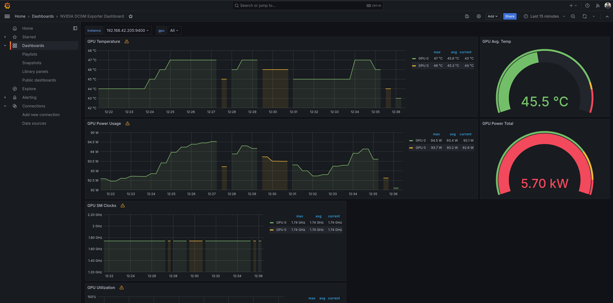
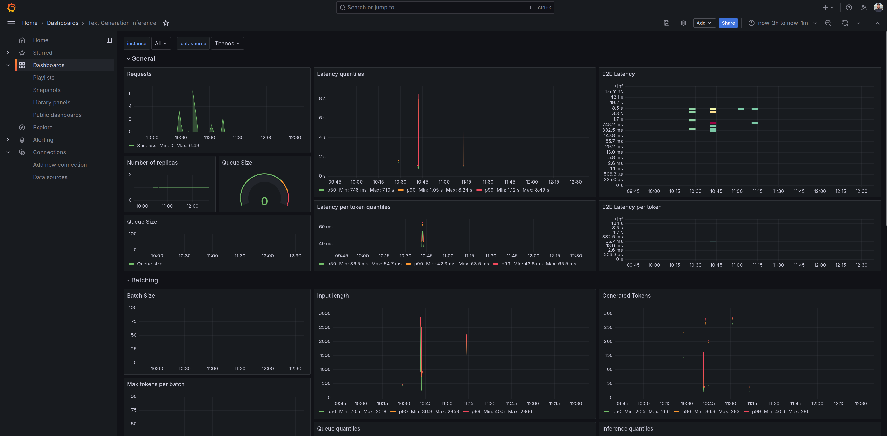

# self-hosted-llm-models-tests

This README contains the techincal notes that resulted from our work and investigations on the deployment of LLM models on Kubernetes in SKS clusters from Exoscale. It is meant to be a repository of the knowledge acquired during our work and as a starting point for future work.

## GPU nodes

For running an LLM model on Kubernetes, we need nodes with a GPU installed.

On Exoscale, the more powerful GPUs available are the [GPU3 Instances](https://www.exoscale.com/pricing/#gpu3-instances), which run NVIDIA A40 GPUs. 

> [!NOTE]
> The GPU3 instances are only available on the `de-fra-1` region.
>
> The `large` and `huge` instances are only available on a dedicated hypervisor and we have not tested them.

> [!IMPORTANT]
> For every Exoscale subscription/organization, a support request needs to be made to allow the creation of these types of instances.

### Adding support for GPU workloads on Kubernetes

Exoscale provides a simple guide on how to enable GPU support in SKS nodes, available [here](https://community.exoscale.com/documentation/sks/gpu-sks-nodes/).

> [!NOTE]
> The Exoscale documentation note that the SKS cluster needs to be on the `Pro` plan and not on the `Starter` plan, but we've been able to instantiate the GPU nodes on a cluster with the latter.

From what we've gathered, the Exoscale GPU nodes already satisfy the [prerequisites](https://github.com/NVIDIA/k8s-device-plugin?tab=readme-ov-file#prerequisites) for the NVIDIA Device Plugin and we only need to install it.

We choose to install it as an Helm chart and configure it through the chart values, as recommended for production deployments. More information about the NVIDIA utilities or plugins used will be in the README.md in the [respective charts folder](https://github.com/camptocamp/self-hosted-llm-models-charts/tree/main/charts/nvidia-utilities).

We did not explore all the [configuration possibilities](https://github.com/NVIDIA/k8s-device-plugin?tab=readme-ov-file#configuring-the-nvidia-device-plugin-binary) for the NVIDIA Device Plugin.

> [!NOTE]
> We played a bit with the possibility of sharing a GPU through multiple workloads (by default, if a pod needs a GPU, it will be exclusively attached to it a not any other pod), but the performance implications resulting from that configuration were not tested.

## Running LLM models

### General deployment architecture

> [!IMPORTANT]
> You might question further how the charts for this test cluster are deployed and organized. We expect this section contains the answers you are looking for.

The Terraform code for this cluster creates an Argo CD project and Application called `llm-apps`. The code for this creation is in [this file](https://github.com/camptocamp/self-hosted-llm-models-tests/blob/main/terraform/llm_apps.tf) and the Argo CD Application is just the deployment from [this chart](https://github.com/camptocamp/self-hosted-llm-models-tests/tree/main/llm-apps) contained in this repository.

That chart itself then contains Kubernetes manifests that will create the [Argo CD Application for the NVIDIA Utilities](https://github.com/camptocamp/self-hosted-llm-models-tests/blob/main/llm-apps/templates/argocd_application_nvidia_utilities.yaml) but most importantly the manifests for creating an Argo CD project and ApplicationSet for each engineer that worked on the project. These manifests are found [here](https://github.com/camptocamp/self-hosted-llm-models-tests/tree/main/llm-apps/templates/work_environments) and the list of engineers is obtained from the local variable `engineers` found [here](https://github.com/camptocamp/self-hosted-llm-models-tests/tree/main/terraform/locals.tf).

For each engineer's application, we then obtain the common chart from [this repository](https://github.com/camptocamp/self-hosted-llm-models-charts) but the engineer then must provide a repository with the respective personal values for each chart. For example, this is @lentidas's [repository](https://github.com/lentidas/self-hosted-llm-models-values).

### Hugging Face's Text Generation Inference

#### Deployment

We've created a simple chart [here](https://github.com/camptocamp/self-hosted-llm-models-charts/tree/main/charts/text-generation-inference) that deploys Hugging Face's Text Generation Inference on a Kubernetes cluster.

> [!IMPORTANT]
> When accessing gated models, you need a Huggging Face token to access them. This can be manually added with the following command:
> ```shell
> kubectl --kubeconfig ~/.kube/is-sandbox-exo-gh-llm-sks-cluster.config -n huggingface-apps create secret generic huggingface-token --from-literal token=YOUR-TOKEN-HERE
> ```

> [!NOTE]
> For this deployment in particular, these secrets are created by [this Terraform code](https://github.com/camptocamp/self-hosted-llm-models-tests/tree/main/terraform/secrets.tf).

#### Interacting with the deployed LLM model

We've tested its functionality by port-forwarding directly to the pod created by the chart and then running a command like the following:

```shell
curl 127.0.0.1:8080/generate_stream \
    -X POST \
    -d '{"inputs":"What is Deep Learning?","parameters":{"max_new_tokens":200}}' \
    -H 'Content-Type: application/json'
```

**We've not customized the prompt parameters any further than increasing and decreasing the `max_new_tokens` parameter.**

Later, we will also interacted with the model through Chat UI.

### [llama.cpp](https://github.com/ggerganov/llama.cpp/tree/master)

#### Deployment

LLama.cpp has been implemented by this [chart](https://github.com/camptocamp/self-hosted-llm-models-charts/tree/main/charts/llama-cpp).

The [image](https://github.com/camptocamp/self-hosted-llm-models-charts/blob/main/charts/llama-cpp/values.yaml#L12-L15) provides its own web service endpoint where we can interact with prompts, not only programmatically but with any browser.

Currently you need to port-forward to the pod, as the service and ingress objects will be implemented together with authentication at a later stage.

#### Interacting with the [API](https://github.com/ggerganov/llama.cpp/blob/master/examples/server/README.md#api-endpoints)

```shell
# generate answer by providing a prompt
curl http://localhost:8080/completion \
     --data '{"prompt":"What is Deep Learning?", "n_predict": 128}' \
     --header 'Content-Type: application/json'

# with OpenAI API specification 
# see https://github.com/openai/openai-openapi/blob/master/openapi.yaml
curl http://localhost:8080/v1/chat/completions \
     --data '{"messages": [{"role": "system", "content": "You are a helpful assistant."},
             {"role": "user", "content": "Who won the soccer world cup in 2018?"}]}' \ 
     --header 'Content-Type: application/json'

# check health
curl http://localhost:8080/health

# read metrics
curl http://localhost:8080/metrics
```

### Tested models

#### meta-llama/Meta-Llama-3.1-8B-Instruct

Using TGI and Llama.cpp we were able to deploy this model quite easily and then interact with it through `curl` commands.

> [!IMPORTANT]
> Each deployment required a GPU for it to work. We were able to run both simultaneously using 2 `small` or 1 `medium` GPU3 node. More powerful CPUs might be able to run both models simultaneously.

#### meta-llama/Meta-Llama-3.1-70B-Instruct

Even with the GPU3 `medium` instances from Exoscale, we were unable to run this model. From what we've gathered, the limiting factor seems to be the insufficient GPU memory.

A possible solution that we've not tested yet might be to reduce the model's precision by quantizing it.

For reference, here are the logs from the TGI pod:

```
stream logs failed container "text-generation-inference" in pod "text-generation-inference-67869c9b65-6j2px" is waiting to start: ContainerCreating for huggingface-apps/text-generation-inference-67869c9b65-6j2px (text-generation-inference)
stream logs failed container "text-generation-inference" in pod "text-generation-inference-67869c9b65-6j2px" is waiting to start: ContainerCreating for huggingface-apps/text-generation-inference-67869c9b65-6j2px (text-generation-inference)
stream logs failed container "text-generation-inference" in pod "text-generation-inference-67869c9b65-6j2px" is waiting to start: ContainerCreating for huggingface-apps/text-generation-inference-67869c9b65-6j2px (text-generation-inference)
stream logs failed container "text-generation-inference" in pod "text-generation-inference-67869c9b65-6j2px" is waiting to start: ContainerCreating for huggingface-apps/text-generation-inference-67869c9b65-6j2px (text-generation-inference)
stream logs failed container "text-generation-inference" in pod "text-generation-inference-67869c9b65-6j2px" is waiting to start: ContainerCreating for huggingface-apps/text-generation-inference-67869c9b65-6j2px (text-generation-inference)
stream logs failed container "text-generation-inference" in pod "text-generation-inference-67869c9b65-6j2px" is waiting to start: ContainerCreating for huggingface-apps/text-generation-inference-67869c9b65-6j2px (text-generation-inference)
2024-06-17T13:11:09.417238Z  INFO text_generation_launcher: Args {
    model_id: "meta-llama/Meta-Llama-3-70B-Instruct",
    revision: None,
    validation_workers: 2,
    sharded: None,
    num_shard: None,
    quantize: None,
    speculate: None,
    dtype: None,
    trust_remote_code: false,
    max_concurrent_requests: 128,
    max_best_of: 2,
    max_stop_sequences: 4,
    max_top_n_tokens: 5,
    max_input_tokens: None,
    max_input_length: None,
    max_total_tokens: None,
    waiting_served_ratio: 0.3,
    max_batch_prefill_tokens: None,
    max_batch_total_tokens: None,
    max_waiting_tokens: 20,
    max_batch_size: None,
    cuda_graphs: None,
    hostname: "text-generation-inference-67869c9b65-6j2px",
    port: 8080,
    shard_uds_path: "/tmp/text-generation-server",
    master_addr: "localhost",
    master_port: 29500,
    huggingface_hub_cache: Some(
        "/data",
    ),
    weights_cache_override: None,
    disable_custom_kernels: false,
    cuda_memory_fraction: 1.0,
    rope_scaling: None,
    rope_factor: None,
    json_output: false,
    otlp_endpoint: None,
    cors_allow_origin: ],
    watermark_gamma: None,
    watermark_delta: None,
    ngrok: false,
    ngrok_authtoken: None,
    ngrok_edge: None,
    tokenizer_config_path: None,
    disable_grammar_support: false,
    env: false,
    max_client_batch_size: 4,
}
2024-06-17T13:11:09.417323Z  INFO hf_hub: Token file not found "/root/.cache/huggingface/token"    
2024-06-17T13:11:09.543606Z  INFO text_generation_launcher: Default `max_input_tokens` to 4095
2024-06-17T13:11:09.543628Z  INFO text_generation_launcher: Default `max_total_tokens` to 4096
2024-06-17T13:11:09.543631Z  INFO text_generation_launcher: Default `max_batch_prefill_tokens` to 4145
2024-06-17T13:11:09.543633Z  INFO text_generation_launcher: Using default cuda graphs [1, 2, 4, 8, 16, 32]
2024-06-17T13:11:09.543642Z  INFO text_generation_launcher: Sharding model on 2 processes
2024-06-17T13:11:09.543717Z  INFO download: text_generation_launcher: Starting download process.
2024-06-17T13:11:12.946148Z  INFO text_generation_launcher: Files are already present on the host. Skipping download.
2024-06-17T13:11:13.648486Z  INFO download: text_generation_launcher: Successfully downloaded weights.
2024-06-17T13:11:13.648865Z  INFO shard-manager: text_generation_launcher: Starting shard rank=0
2024-06-17T13:11:13.648935Z  INFO shard-manager: text_generation_launcher: Starting shard rank=1
2024-06-17T13:11:16.975709Z  INFO text_generation_launcher: Detected system cuda
2024-06-17T13:11:17.016998Z  INFO text_generation_launcher: Detected system cuda
2024-06-17T13:11:23.660367Z  INFO shard-manager: text_generation_launcher: Waiting for shard to be ready... rank=0
2024-06-17T13:11:23.660559Z  INFO shard-manager: text_generation_launcher: Waiting for shard to be ready... rank=1
2024-06-17T13:11:33.670536Z  INFO shard-manager: text_generation_launcher: Waiting for shard to be ready... rank=1
2024-06-17T13:11:33.670835Z  INFO shard-manager: text_generation_launcher: Waiting for shard to be ready... rank=0
2024-06-17T13:11:43.680628Z  INFO shard-manager: text_generation_launcher: Waiting for shard to be ready... rank=1
2024-06-17T13:11:43.680705Z  INFO shard-manager: text_generation_launcher: Waiting for shard to be ready... rank=0
2024-06-17T13:11:53.689770Z  INFO shard-manager: text_generation_launcher: Waiting for shard to be ready... rank=0
2024-06-17T13:11:53.689773Z  INFO shard-manager: text_generation_launcher: Waiting for shard to be ready... rank=1
2024-06-17T13:12:03.698378Z  INFO shard-manager: text_generation_launcher: Waiting for shard to be ready... rank=1
2024-06-17T13:12:03.699114Z  INFO shard-manager: text_generation_launcher: Waiting for shard to be ready... rank=0
2024-06-17T13:12:13.707648Z  INFO shard-manager: text_generation_launcher: Waiting for shard to be ready... rank=1
2024-06-17T13:12:13.708747Z  INFO shard-manager: text_generation_launcher: Waiting for shard to be ready... rank=0
2024-06-17T13:12:23.717162Z  INFO shard-manager: text_generation_launcher: Waiting for shard to be ready... rank=1
2024-06-17T13:12:23.718950Z  INFO shard-manager: text_generation_launcher: Waiting for shard to be ready... rank=0
2024-06-17T13:12:33.728045Z  INFO shard-manager: text_generation_launcher: Waiting for shard to be ready... rank=1
2024-06-17T13:12:33.728556Z  INFO shard-manager: text_generation_launcher: Waiting for shard to be ready... rank=0
2024-06-17T13:12:43.737759Z  INFO shard-manager: text_generation_launcher: Waiting for shard to be ready... rank=1
2024-06-17T13:12:43.738366Z  INFO shard-manager: text_generation_launcher: Waiting for shard to be ready... rank=0
2024-06-17T13:12:53.747832Z  INFO shard-manager: text_generation_launcher: Waiting for shard to be ready... rank=1
2024-06-17T13:12:53.748218Z  INFO shard-manager: text_generation_launcher: Waiting for shard to be ready... rank=0
2024-06-17T13:13:03.756532Z  INFO shard-manager: text_generation_launcher: Waiting for shard to be ready... rank=1
2024-06-17T13:13:03.756944Z  INFO shard-manager: text_generation_launcher: Waiting for shard to be ready... rank=0
2024-06-17T13:13:13.766353Z  INFO shard-manager: text_generation_launcher: Waiting for shard to be ready... rank=1
2024-06-17T13:13:13.767390Z  INFO shard-manager: text_generation_launcher: Waiting for shard to be ready... rank=0
2024-06-17T13:13:23.775729Z  INFO shard-manager: text_generation_launcher: Waiting for shard to be ready... rank=1
2024-06-17T13:13:23.776327Z  INFO shard-manager: text_generation_launcher: Waiting for shard to be ready... rank=0
2024-06-17T13:13:33.785201Z  INFO shard-manager: text_generation_launcher: Waiting for shard to be ready... rank=1
2024-06-17T13:13:33.785244Z  INFO shard-manager: text_generation_launcher: Waiting for shard to be ready... rank=0
2024-06-17T13:13:43.794274Z  INFO shard-manager: text_generation_launcher: Waiting for shard to be ready... rank=0
2024-06-17T13:13:43.798835Z  INFO shard-manager: text_generation_launcher: Waiting for shard to be ready... rank=1
2024-06-17T13:13:53.803290Z  INFO shard-manager: text_generation_launcher: Waiting for shard to be ready... rank=0
2024-06-17T13:13:53.807702Z  INFO shard-manager: text_generation_launcher: Waiting for shard to be ready... rank=1
2024-06-17T13:14:03.812941Z  INFO shard-manager: text_generation_launcher: Waiting for shard to be ready... rank=0
2024-06-17T13:14:03.817774Z  INFO shard-manager: text_generation_launcher: Waiting for shard to be ready... rank=1
2024-06-17T13:14:13.822419Z  INFO shard-manager: text_generation_launcher: Waiting for shard to be ready... rank=0
2024-06-17T13:14:13.828131Z  INFO shard-manager: text_generation_launcher: Waiting for shard to be ready... rank=1
2024-06-17T13:14:23.832744Z  INFO shard-manager: text_generation_launcher: Waiting for shard to be ready... rank=0
2024-06-17T13:14:23.838818Z  INFO shard-manager: text_generation_launcher: Waiting for shard to be ready... rank=1
2024-06-17T13:14:33.843034Z  INFO shard-manager: text_generation_launcher: Waiting for shard to be ready... rank=0
2024-06-17T13:14:33.848408Z  INFO shard-manager: text_generation_launcher: Waiting for shard to be ready... rank=1
2024-06-17T13:14:43.853939Z  INFO shard-manager: text_generation_launcher: Waiting for shard to be ready... rank=0
2024-06-17T13:14:43.858796Z  INFO shard-manager: text_generation_launcher: Waiting for shard to be ready... rank=1
2024-06-17T13:14:53.863016Z  INFO shard-manager: text_generation_launcher: Waiting for shard to be ready... rank=0
2024-06-17T13:14:53.867611Z  INFO shard-manager: text_generation_launcher: Waiting for shard to be ready... rank=1
2024-06-17T13:15:03.873177Z  INFO shard-manager: text_generation_launcher: Waiting for shard to be ready... rank=0
2024-06-17T13:15:03.877365Z  INFO shard-manager: text_generation_launcher: Waiting for shard to be ready... rank=1
2024-06-17T13:15:13.882463Z  INFO shard-manager: text_generation_launcher: Waiting for shard to be ready... rank=0
2024-06-17T13:15:13.886028Z  INFO shard-manager: text_generation_launcher: Waiting for shard to be ready... rank=1
2024-06-17T13:15:23.893656Z  INFO shard-manager: text_generation_launcher: Waiting for shard to be ready... rank=0
2024-06-17T13:15:23.895302Z  INFO shard-manager: text_generation_launcher: Waiting for shard to be ready... rank=1
2024-06-17T13:15:33.905075Z  INFO shard-manager: text_generation_launcher: Waiting for shard to be ready... rank=1
2024-06-17T13:15:33.905375Z  INFO shard-manager: text_generation_launcher: Waiting for shard to be ready... rank=0
2024-06-17T13:15:43.914435Z  INFO shard-manager: text_generation_launcher: Waiting for shard to be ready... rank=1
2024-06-17T13:15:43.915630Z  INFO shard-manager: text_generation_launcher: Waiting for shard to be ready... rank=0
2024-06-17T13:15:53.924147Z  INFO shard-manager: text_generation_launcher: Waiting for shard to be ready... rank=1
2024-06-17T13:15:53.926449Z  INFO shard-manager: text_generation_launcher: Waiting for shard to be ready... rank=0
2024-06-17T13:16:03.933869Z  INFO shard-manager: text_generation_launcher: Waiting for shard to be ready... rank=1
2024-06-17T13:16:03.936361Z  INFO shard-manager: text_generation_launcher: Waiting for shard to be ready... rank=0
2024-06-17T13:16:13.942833Z  INFO shard-manager: text_generation_launcher: Waiting for shard to be ready... rank=1
2024-06-17T13:16:13.945206Z  INFO shard-manager: text_generation_launcher: Waiting for shard to be ready... rank=0
2024-06-17T13:16:23.952885Z  INFO shard-manager: text_generation_launcher: Waiting for shard to be ready... rank=1
2024-06-17T13:16:23.954552Z  INFO shard-manager: text_generation_launcher: Waiting for shard to be ready... rank=0
2024-06-17T13:16:33.962415Z  INFO shard-manager: text_generation_launcher: Waiting for shard to be ready... rank=1
2024-06-17T13:16:33.963775Z  INFO shard-manager: text_generation_launcher: Waiting for shard to be ready... rank=0
2024-06-17T13:16:43.971685Z  INFO shard-manager: text_generation_launcher: Waiting for shard to be ready... rank=1
2024-06-17T13:16:43.973422Z  INFO shard-manager: text_generation_launcher: Waiting for shard to be ready... rank=0
2024-06-17T13:16:53.982154Z  INFO shard-manager: text_generation_launcher: Waiting for shard to be ready... rank=0
2024-06-17T13:16:53.982169Z  INFO shard-manager: text_generation_launcher: Waiting for shard to be ready... rank=1
2024-06-17T13:17:03.991395Z  INFO shard-manager: text_generation_launcher: Waiting for shard to be ready... rank=1
2024-06-17T13:17:03.991561Z  INFO shard-manager: text_generation_launcher: Waiting for shard to be ready... rank=0
2024-06-17T13:17:14.001024Z  INFO shard-manager: text_generation_launcher: Waiting for shard to be ready... rank=0
2024-06-17T13:17:14.001634Z  INFO shard-manager: text_generation_launcher: Waiting for shard to be ready... rank=1
2024-06-17T13:17:24.010221Z  INFO shard-manager: text_generation_launcher: Waiting for shard to be ready... rank=0
2024-06-17T13:17:24.010512Z  INFO shard-manager: text_generation_launcher: Waiting for shard to be ready... rank=1
2024-06-17T13:17:34.019684Z  INFO shard-manager: text_generation_launcher: Waiting for shard to be ready... rank=0
2024-06-17T13:17:34.019699Z  INFO shard-manager: text_generation_launcher: Waiting for shard to be ready... rank=1
2024-06-17T13:17:44.028716Z  INFO shard-manager: text_generation_launcher: Waiting for shard to be ready... rank=1
2024-06-17T13:17:44.029137Z  INFO shard-manager: text_generation_launcher: Waiting for shard to be ready... rank=0
2024-06-17T13:17:54.037855Z  INFO shard-manager: text_generation_launcher: Waiting for shard to be ready... rank=1
2024-06-17T13:17:54.038852Z  INFO shard-manager: text_generation_launcher: Waiting for shard to be ready... rank=0
2024-06-17T13:18:04.047265Z  INFO shard-manager: text_generation_launcher: Waiting for shard to be ready... rank=1
2024-06-17T13:18:04.047798Z  INFO shard-manager: text_generation_launcher: Waiting for shard to be ready... rank=0
2024-06-17T13:18:14.056664Z  INFO shard-manager: text_generation_launcher: Waiting for shard to be ready... rank=1
2024-06-17T13:18:14.058514Z  INFO shard-manager: text_generation_launcher: Waiting for shard to be ready... rank=0
2024-06-17T13:18:24.066369Z  INFO shard-manager: text_generation_launcher: Waiting for shard to be ready... rank=1
2024-06-17T13:18:24.067545Z  INFO shard-manager: text_generation_launcher: Waiting for shard to be ready... rank=0
  File "/opt/conda/lib/python3.10/site-packages/text_generation_server/server.py", line 263, in serve
    asyncio.run(
  File "/opt/conda/lib/python3.10/asyncio/runners.py", line 44, in run
    return loop.run_until_complete(main)
  File "/opt/conda/lib/python3.10/asyncio/base_events.py", line 636, in run_until_complete
    self.run_forever()
  File "/opt/conda/lib/python3.10/asyncio/base_events.py", line 603, in run_forever
    self._run_once()
  File "/opt/conda/lib/python3.10/asyncio/base_events.py", line 1909, in _run_once
    handle._run()
  File "/opt/conda/lib/python3.10/asyncio/events.py", line 80, in _run
    self._context.run(self._callback, *self._args)
> File "/opt/conda/lib/python3.10/site-packages/text_generation_server/server.py", line 225, in serve_inner
    model = get_model(
  File "/opt/conda/lib/python3.10/site-packages/text_generation_server/models/__init__.py", line 591, in get_model
    return FlashLlama(
  File "/opt/conda/lib/python3.10/site-packages/text_generation_server/models/flash_llama.py", line 74, in __init__
    model = FlashLlamaForCausalLM(prefix, config, weights)
  File "/opt/conda/lib/python3.10/site-packages/text_generation_server/models/custom_modeling/flash_llama_modeling.py", line 402, in __init__
    self.model = FlashLlamaModel(prefix, config, weights)
  File "/opt/conda/lib/python3.10/site-packages/text_generation_server/models/custom_modeling/flash_llama_modeling.py", line 326, in __init__
    [
  File "/opt/conda/lib/python3.10/site-packages/text_generation_server/models/custom_modeling/flash_llama_modeling.py", line 327, in <listcomp>
    FlashLlamaLayer(
  File "/opt/conda/lib/python3.10/site-packages/text_generation_server/models/custom_modeling/flash_llama_modeling.py", line 269, in __init__
    self.mlp = LlamaMLP(prefix=f"{prefix}.mlp", config=config, weights=weights)
  File "/opt/conda/lib/python3.10/site-packages/text_generation_server/models/custom_modeling/flash_llama_modeling.py", line 222, in __init__
    self.gate_up_proj = TensorParallelColumnLinear.load_multi(
  File "/opt/conda/lib/python3.10/site-packages/text_generation_server/layers/tensor_parallel.py", line 175, in load_multi
    weight = weights.get_multi_weights_col(
  File "/opt/conda/lib/python3.10/site-packages/text_generation_server/utils/weights.py", line 439, in get_multi_weights_col
    w = [self.get_sharded(f"{p}.weight", dim=0) for p in prefixes]
  File "/opt/conda/lib/python3.10/site-packages/text_generation_server/utils/weights.py", line 439, in <listcomp>
    w = [self.get_sharded(f"{p}.weight", dim=0) for p in prefixes]
  File "/opt/conda/lib/python3.10/site-packages/text_generation_server/utils/weights.py", line 131, in get_sharded
    return self.get_partial_sharded(tensor_name, dim)
  File "/opt/conda/lib/python3.10/site-packages/text_generation_server/utils/weights.py", line 119, in get_partial_sharded
    tensor = tensor.to(device=self.device)
torch.cuda.OutOfMemoryError: CUDA out of memory. Tried to allocate 224.00 MiB. GPU
2024-06-17T13:18:26.673888Z ERROR text_generation_launcher: Error when initializing model
Traceback (most recent call last):
  File "/opt/conda/bin/text-generation-server", line 8, in <module>
    sys.exit(app())
  File "/opt/conda/lib/python3.10/site-packages/typer/main.py", line 311, in __call__
    return get_command(self)(*args, **kwargs)
  File "/opt/conda/lib/python3.10/site-packages/click/core.py", line 1157, in __call__
    return self.main(*args, **kwargs)
  File "/opt/conda/lib/python3.10/site-packages/typer/core.py", line 778, in main
    return _main(
  File "/opt/conda/lib/python3.10/site-packages/typer/core.py", line 216, in _main
    rv = self.invoke(ctx)
  File "/opt/conda/lib/python3.10/site-packages/click/core.py", line 1688, in invoke
    return _process_result(sub_ctx.command.invoke(sub_ctx))
  File "/opt/conda/lib/python3.10/site-packages/click/core.py", line 1434, in invoke
    return ctx.invoke(self.callback, **ctx.params)
  File "/opt/conda/lib/python3.10/site-packages/click/core.py", line 783, in invoke
    return __callback(*args, **kwargs)
  File "/opt/conda/lib/python3.10/site-packages/typer/main.py", line 683, in wrapper
    return callback(**use_params)  # type: ignore
  File "/opt/conda/lib/python3.10/site-packages/text_generation_server/cli.py", line 93, in serve
    server.serve(
  File "/opt/conda/lib/python3.10/site-packages/text_generation_server/server.py", line 263, in serve
    asyncio.run(
  File "/opt/conda/lib/python3.10/asyncio/runners.py", line 44, in run
    return loop.run_until_complete(main)
  File "/opt/conda/lib/python3.10/asyncio/base_events.py", line 636, in run_until_complete
    self.run_forever()
  File "/opt/conda/lib/python3.10/asyncio/base_events.py", line 603, in run_forever
    self._run_once()
  File "/opt/conda/lib/python3.10/asyncio/base_events.py", line 1909, in _run_once
    handle._run()
  File "/opt/conda/lib/python3.10/asyncio/events.py", line 80, in _run
    self._context.run(self._callback, *self._args)
> File "/opt/conda/lib/python3.10/site-packages/text_generation_server/server.py", line 225, in serve_inner
    model = get_model(
  File "/opt/conda/lib/python3.10/site-packages/text_generation_server/models/__init__.py", line 591, in get_model
    return FlashLlama(
  File "/opt/conda/lib/python3.10/site-packages/text_generation_server/models/flash_llama.py", line 74, in __init__
    model = FlashLlamaForCausalLM(prefix, config, weights)
  File "/opt/conda/lib/python3.10/site-packages/text_generation_server/models/custom_modeling/flash_llama_modeling.py", line 402, in __init__
    self.model = FlashLlamaModel(prefix, config, weights)
  File "/opt/conda/lib/python3.10/site-packages/text_generation_server/models/custom_modeling/flash_llama_modeling.py", line 326, in __init__
    [
  File "/opt/conda/lib/python3.10/site-packages/text_generation_server/models/custom_modeling/flash_llama_modeling.py", line 327, in <listcomp>
    FlashLlamaLayer(
  File "/opt/conda/lib/python3.10/site-packages/text_generation_server/models/custom_modeling/flash_llama_modeling.py", line 269, in __init__
    self.mlp = LlamaMLP(prefix=f"{prefix}.mlp", config=config, weights=weights)
  File "/opt/conda/lib/python3.10/site-packages/text_generation_server/models/custom_modeling/flash_llama_modeling.py", line 222, in __init__
    self.gate_up_proj = TensorParallelColumnLinear.load_multi(
  File "/opt/conda/lib/python3.10/site-packages/text_generation_server/layers/tensor_parallel.py", line 175, in load_multi
    weight = weights.get_multi_weights_col(
  File "/opt/conda/lib/python3.10/site-packages/text_generation_server/utils/weights.py", line 439, in get_multi_weights_col
    w = [self.get_sharded(f"{p}.weight", dim=0) for p in prefixes]
  File "/opt/conda/lib/python3.10/site-packages/text_generation_server/utils/weights.py", line 439, in <listcomp>
    w = [self.get_sharded(f"{p}.weight", dim=0) for p in prefixes]
  File "/opt/conda/lib/python3.10/site-packages/text_generation_server/utils/weights.py", line 131, in get_sharded
    return self.get_partial_sharded(tensor_name, dim)
  File "/opt/conda/lib/python3.10/site-packages/text_generation_server/utils/weights.py", line 119, in get_partial_sharded
    tensor = tensor.to(device=self.device)
torch.cuda.OutOfMemoryError: CUDA out of memory. Tried to allocate 224.00 MiB. GPU  has a total capacity of 44.34 GiB of which 160.81 MiB is free. Process 47694 has 44.17 GiB memory in use. Of the allocated memory 43.36 GiB is allocated by PyTorch, and 396.27 MiB is reserved by PyTorch but unallocated. If reserved but unallocated memory is large try setting PYTORCH_CUDA_ALLOC_CONF=expandable_segments:True to avoid fragmentation.  See documentation for Memory Management  (https://pytorch.org/docs/stable/notes/cuda.html#environment-variables)
2024-06-17T13:18:29.371622Z ERROR shard-manager: text_generation_launcher: Shard complete standard error output:

/opt/conda/lib/python3.10/site-packages/huggingface_hub/file_download.py:1132: FutureWarning: `resume_download` is deprecated and will be removed in version 1.0.0. Downloads always resume when possible. If you want to force a new download, use `force_download=True`.
  warnings.warn(
Special tokens have been added in the vocabulary, make sure the associated word embeddings are fine-tuned or trained.
[rank1]: Traceback (most recent call last):

[rank1]:   File "/opt/conda/bin/text-generation-server", line 8, in <module>
[rank1]:     sys.exit(app())

[rank1]:   File "/opt/conda/lib/python3.10/site-packages/text_generation_server/cli.py", line 93, in serve
[rank1]:     server.serve(

[rank1]:   File "/opt/conda/lib/python3.10/site-packages/text_generation_server/server.py", line 263, in serve
[rank1]:     asyncio.run(

[rank1]:   File "/opt/conda/lib/python3.10/asyncio/runners.py", line 44, in run
[rank1]:     return loop.run_until_complete(main)

[rank1]:   File "/opt/conda/lib/python3.10/asyncio/base_events.py", line 649, in run_until_complete
[rank1]:     return future.result()

[rank1]:   File "/opt/conda/lib/python3.10/site-packages/text_generation_server/server.py", line 225, in serve_inner
[rank1]:     model = get_model(

[rank1]:   File "/opt/conda/lib/python3.10/site-packages/text_generation_server/models/__init__.py", line 591, in get_model
[rank1]:     return FlashLlama(

[rank1]:   File "/opt/conda/lib/python3.10/site-packages/text_generation_server/models/flash_llama.py", line 74, in __init__
[rank1]:     model = FlashLlamaForCausalLM(prefix, config, weights)

[rank1]:   File "/opt/conda/lib/python3.10/site-packages/text_generation_server/models/custom_modeling/flash_llama_modeling.py", line 402, in __init__
[rank1]:     self.model = FlashLlamaModel(prefix, config, weights)

[rank1]:   File "/opt/conda/lib/python3.10/site-packages/text_generation_server/models/custom_modeling/flash_llama_modeling.py", line 326, in __init__
[rank1]:     [

[rank1]:   File "/opt/conda/lib/python3.10/site-packages/text_generation_server/models/custom_modeling/flash_llama_modeling.py", line 327, in <listcomp>
[rank1]:     FlashLlamaLayer(

[rank1]:   File "/opt/conda/lib/python3.10/site-packages/text_generation_server/models/custom_modeling/flash_llama_modeling.py", line 269, in __init__
[rank1]:     self.mlp = LlamaMLP(prefix=f"{prefix}.mlp", config=config, weights=weights)

[rank1]:   File "/opt/conda/lib/python3.10/site-packages/text_generation_server/models/custom_modeling/flash_llama_modeling.py", line 222, in __init__
[rank1]:     self.gate_up_proj = TensorParallelColumnLinear.load_multi(

[rank1]:   File "/opt/conda/lib/python3.10/site-packages/text_generation_server/layers/tensor_parallel.py", line 175, in load_multi
[rank1]:     weight = weights.get_multi_weights_col(

[rank1]:   File "/opt/conda/lib/python3.10/site-packages/text_generation_server/utils/weights.py", line 439, in get_multi_weights_col
[rank1]:     w = [self.get_sharded(f"{p}.weight", dim=0) for p in prefixes]

[rank1]:   File "/opt/conda/lib/python3.10/site-packages/text_generation_server/utils/weights.py", line 439, in <listcomp>
[rank1]:     w = [self.get_sharded(f"{p}.weight", dim=0) for p in prefixes]

[rank1]:   File "/opt/conda/lib/python3.10/site-packages/text_generation_server/utils/weights.py", line 131, in get_sharded
[rank1]:     return self.get_partial_sharded(tensor_name, dim)

[rank1]:   File "/opt/conda/lib/python3.10/site-packages/text_generation_server/utils/weights.py", line 119, in get_partial_sharded
[rank1]:     tensor = tensor.to(device=self.device)

[rank1]: torch.cuda.OutOfMemoryError: CUDA out of memory. Tried to allocate 224.00 MiB. GPU  has a total capacity of 44.34 GiB of which 160.81 MiB is free. Process 47694 has 44.17 GiB memory in use. Of the allocated memory 43.36 GiB is allocated by PyTorch, and 396.27 MiB is reserved by PyTorch but unallocated. If reserved but unallocated memory is large try setting PYTORCH_CUDA_ALLOC_CONF=expandable_segments:True to avoid fragmentation.  See documentation for Memory Management  (https://pytorch.org/docs/stable/notes/cuda.html#environment-variables)
 rank=1
2024-06-17T13:18:29.406790Z ERROR text_generation_launcher: Shard 1 failed to start
2024-06-17T13:18:29.406822Z  INFO text_generation_launcher: Shutting down shards
2024-06-17T13:18:29.472875Z  INFO shard-manager: text_generation_launcher: Terminating shard rank=0
2024-06-17T13:18:29.473196Z  INFO shard-manager: text_generation_launcher: Waiting for shard to gracefully shutdown rank=0
2024-06-17T13:18:30.174163Z  INFO shard-manager: text_generation_launcher: shard terminated rank=0
Error: ShardCannotStart
Stream closed EOF for huggingface-apps/text-generation-inference-67869c9b65-6j2px (text-generation-inference)
```

## Monitoring

### Monitoring the GPUs

We've deployed the NVIDIA DCGM Exporter to gather metrics from the GPU and export them to Prometheus. We were then able to check them in a Grafana dashboard like the screenshot below.



### Monitoring the model

Both Llama.cpp and TGI export metrics that allow us to monitor the model performance. Below, you will find a screenshot of the respective Grafana dashboard.


